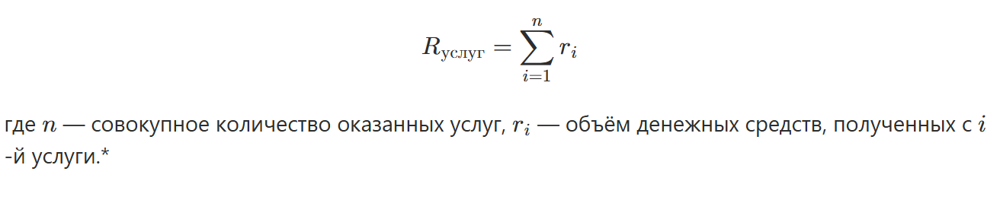

[Вернуться на главную страницу руководства](readme.md)
# Показатели выручки
## Выручка по услугам
### Альтернативные наименования
-	Фактическая выручка, руб;
-	Выручка;
-	Revenue;
### Формула расчёта

### Краткое описание параметра
__Выручка по услугам__ - Суммарная выручка по оказанным услугам